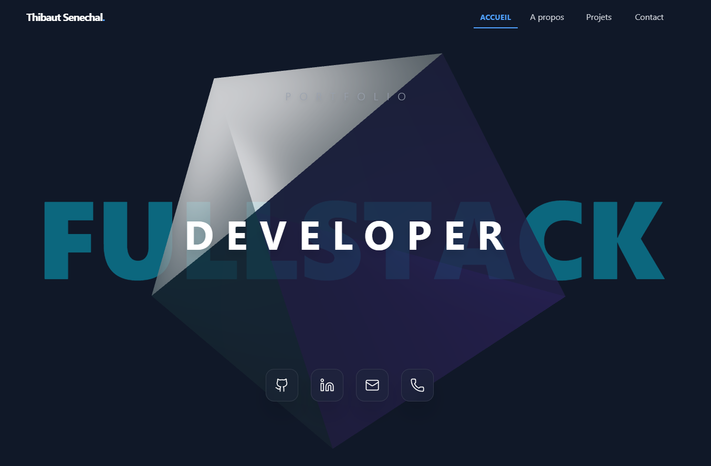

# ✦ Portfolio 3D Interactif

> Une expérience web immersive mettant en scène mes projets via une navigation 3D fluide et interactive.

---

## 🌐 Visiter le site
👉 **[Voir le Rendu en ligne](https://nerion-1337.github.io/portfolio_2026/)**

---

## 📸 Aperçu

## 🎯 Objectifs & Fonctionnalités

Ce projet a été conçu pour dépasser le cadre du portfolio classique en proposant une expérience utilisateur (UX) unique :

- **Navigation 3D Immersive** : Utilisation de `React-Three-Fiber` pour créer un carrousel de projets en profondeur.
- **Scroll Infini & Circulaire** : Navigation fluide sans interruption, le dernier projet boucle sur le premier.
- **Responsive & Tactile** :
  - *Desktop* : Navigation à la molette ou au drag & drop souris.
  - *Mobile* : Support complet du "Swipe" tactile et interface adaptée (liste masquée, indicateurs visuels).
- **Performance** : Optimisation des rendus 3D et chargement rapide via Vite.
- **CI/CD** : Déploiement automatique sur GitHub Pages à chaque push.

## 🛠 Stack Technique

Une architecture moderne basée sur l'écosystème React :

| Technologie | Usage |
| :--- | :--- |
| **React 18** | Bibliothèque UI principale |
| **Three.js / R3F** | Moteur 3D pour le carrousel (Canvas) |
| **Drei** | Utilitaires pour Three.js (Html, Text, etc.) |
| **Tailwind CSS** | Styling utilitaire et responsive design |
| **Framer Motion** | Transitions de pages fluides |
| **Vite** | Bundler ultra-rapide |
| **GitHub Actions** | Pipeline de déploiement continu (CD) |

## 👤 Auteur

**Thibaut Senechal**
- [GitHub](https://github.com/Nerion-1337)
- [LinkedIn](https://www.linkedin.com/in/thibaut-senechal-aabbbb199/)

---
*Ce projet a été réalisé avec ❤️ et beaucoup de calculs vectoriels.*
